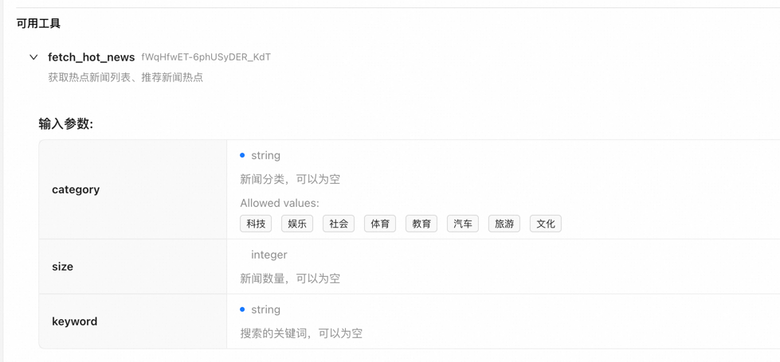
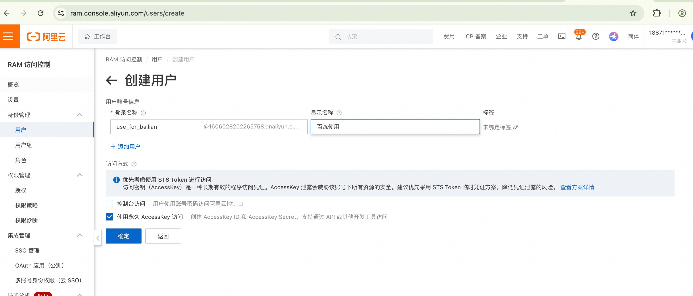
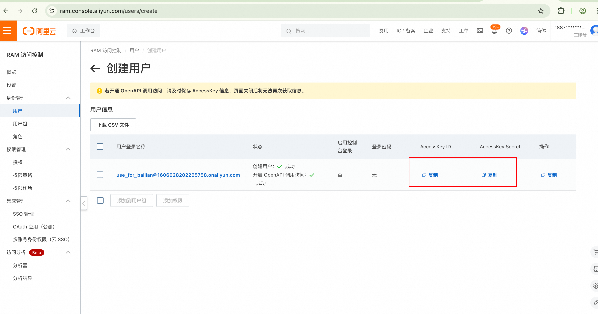
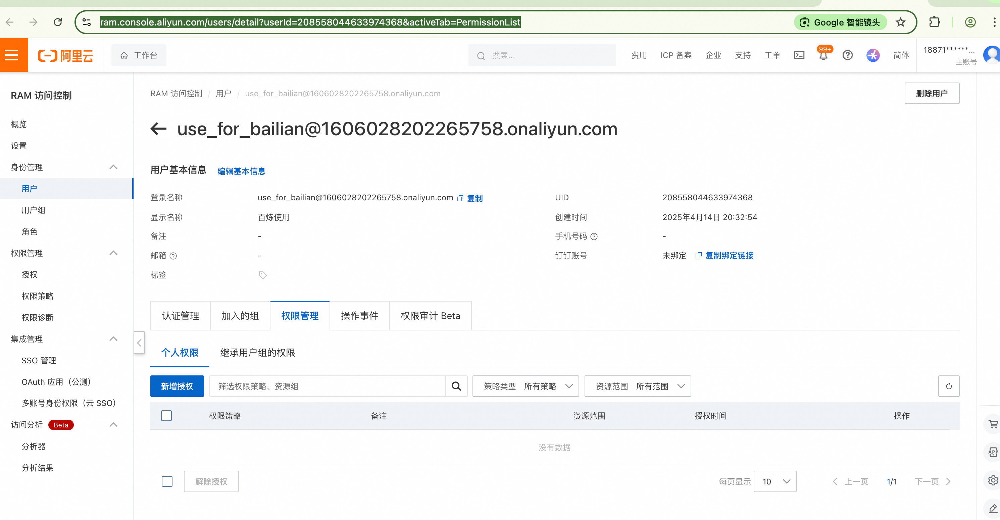
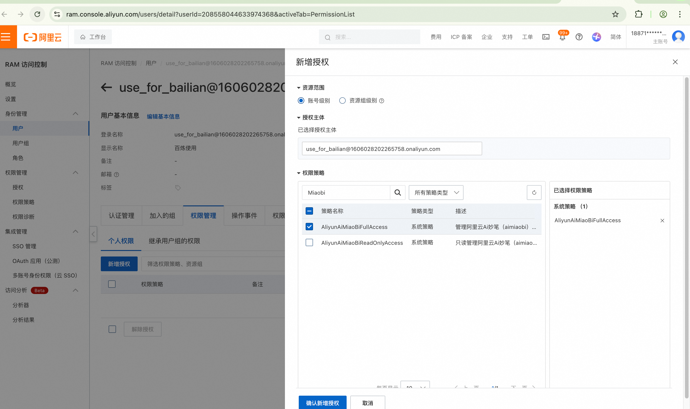
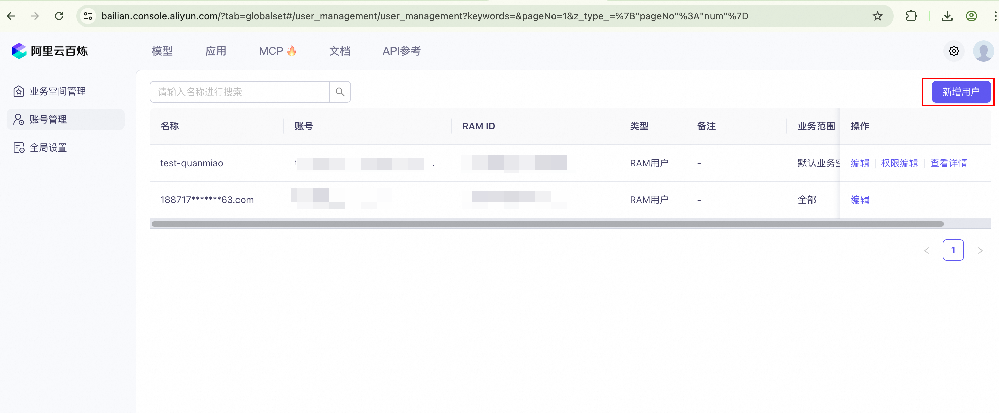
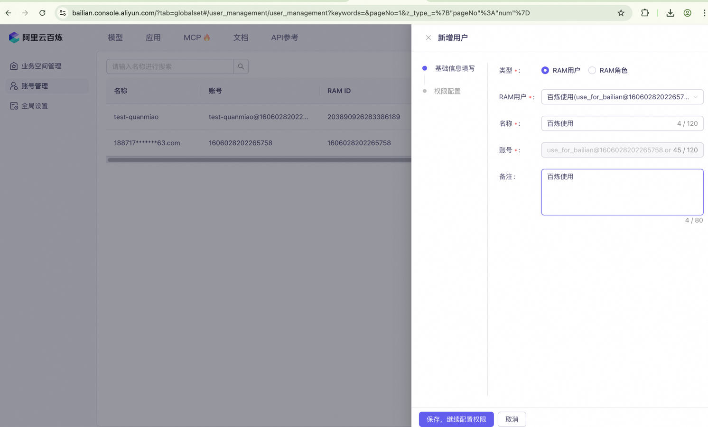
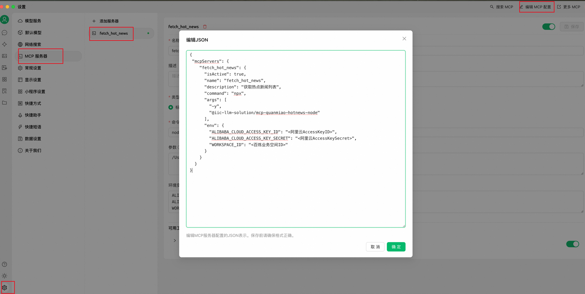
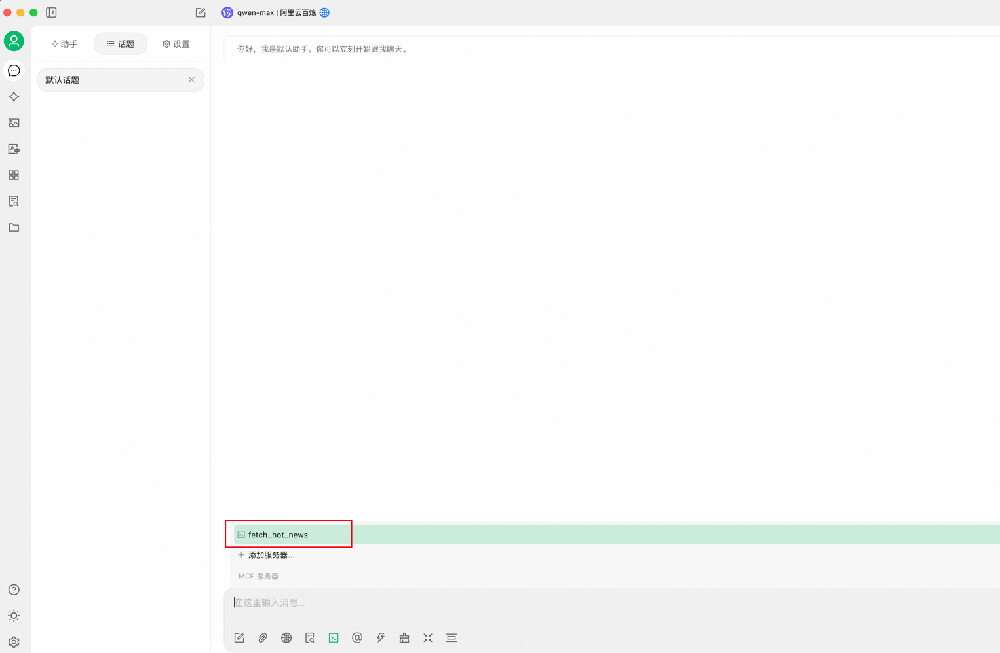
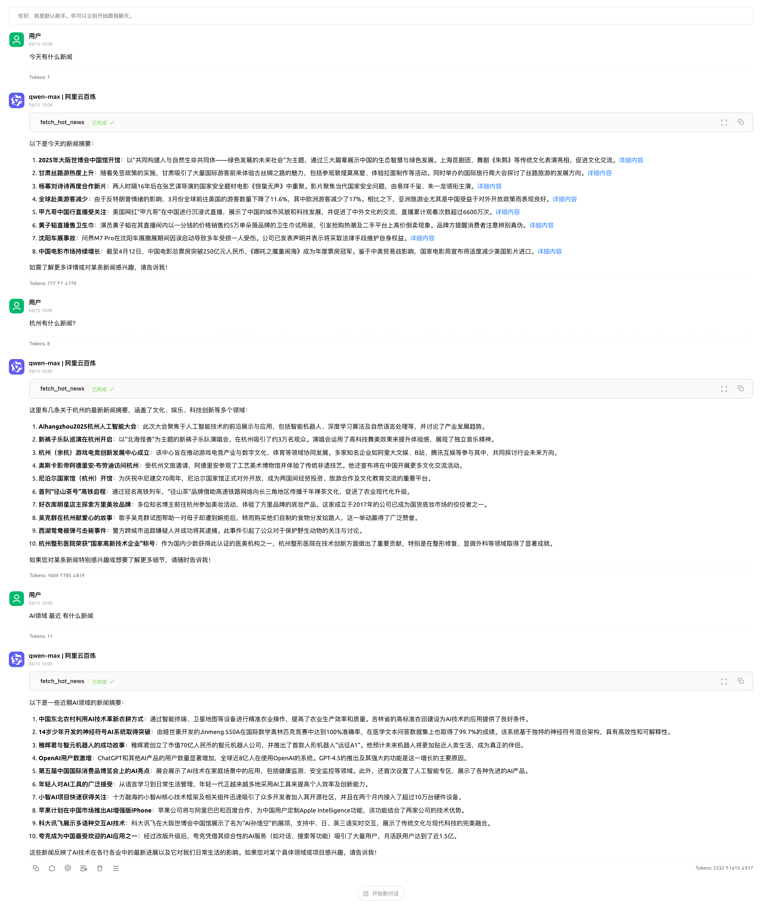

## 全妙新闻播报MCP Server

### 项目简介

全妙新闻播报MCP Server 是一个基于阿里云百炼API的新闻聚合服务，专注于实时获取热点新闻资讯。

#### 提供以下工具列表



### 项目结构

```
├── mcp-quanmiao-hotnews-node/    # Node.js 服务端实现
├── mcp-quanmiao-hotnews-python/  # Python 服务端实现
├── .env.example                  # 环境变量配置示例文件
└── .gitignore                    # Git 忽略文件配置
```

### 环境要求

- Node.js 版本: >= 14.0.0
- 环境变量配置（.env 文件）

### 前置要求

#### 注册阿里云

链接：https://www.aliyun.com/

#### 开通阿里云百炼

链接：https://bailian.console.aliyun.com/

#### 开通 百炼轻应用:车机网络热点信息互动问答

目前限时免费：无需开通

链接：https://bailian.console.aliyun.com/?tab=app#/app/app-market/quanmiao/news-broadcast

#### 获取百炼业务空间ID（workspace_id）

[百炼业务空间管理页面](https://bailian.console.aliyun.com/?tab=globalset#/efm/business_management?agentName=&pageNo=1&z_type_=%7B%22pageNo%22%3A%22num%22%7D)


#### 获取子账号 AK SK

##### 创建RAM用户获取AK、SK

[使用RAM用户创建AKSK](https://ram.console.aliyun.com/users/create)



##### 授权AK、SK访问 POP 接口

[权限管理授予权限](https://ram.console.aliyun.com/users/detail?userId=<新创建的RAM账号ID>&activeTab=PermissionList)





##### 将RAM用户导入到百炼

[百炼用户管理页面](https://bailian.console.aliyun.com/?tab=globalset#/user_management/user_management?keywords=&pageNo=1&z_type_=%7B%22pageNo%22%3A%22num%22%7D)




### 开始运行

#### 配置环境变量

```
ALIBABA_CLOUD_ACCESS_KEY_ID=<阿里云AccessKeyID>
ALIBABA_CLOUD_ACCESS_KEY_SECRET=<阿里云AccessKeySecret>
WORKSPACE_ID=<百炼业务空间ID>
# 传输方式可选：stdio、sse。默认stdio
QUANMIAO_MCP_TRANSPORT=sse
```

#### stdio模式[推荐]

```shell
npx -y  @iic-llm-solution/mcp-quanmiao-hotnews-node
```

```json
{
  "mcpServers": {
    "fetch_hot_news": {
      "isActive": true,
      "name": "fetch_hot_news",
      "description": "获取热点新闻列表",
      "command": "npx",
      "args": [
        "-y",
        "@iic-llm-solution/mcp-quanmiao-hotnews-node"
      ],
      "env": {
        "ALIBABA_CLOUD_ACCESS_KEY_ID": "<阿里云AccessKeyID>",
        "ALIBABA_CLOUD_ACCESS_KEY_SECRET": "<阿里云AccessKeySecret>",
        "WORKSPACE_ID": "<百炼业务空间ID>"
      }
    }
  }
}
```

#### sse模式

```shell
export QUANMIAO_MCP_TRANSPORT=sse && export QUANMIAO_MCP_PORT=8080 &&  npx -y  @iic-llm-solution/mcp-quanmiao-hotnews-node
```

```json
{
  "mcpServers": {
    "fetch_hot_news": {
      "name": "fetch_hot_news",
      "type": "sse",
      "description": "获取热点新闻列表",
      "baseUrl": "http://127.0.0.1:8080"
    }
  }
}
```

### 使用案例

#### 在cherry studio中使用

##### **配置MCP**



##### **在对话中启用MCP**



##### **对话使用**



### 许可证

本项目采用 Apache License 2.0 许可证
详细信息请查看 [LICENSE](./LICENSE) 文件。